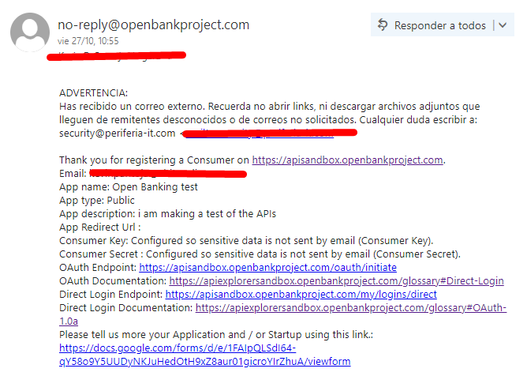

# Open Banking

## Configuración necesaria para interactuar con APIs de Open Bank Project

A fin de hacer uso de las APIs de open bank project se requiere hacer una configuracion inicial. A continuacion se define la configuracion necesaria:

### **1**. Ingresar en [openbankproject.com/](https://apisandbox.openbankproject.com/ "Open Bank Project")
   
### **2**. Crear una cuenta
   

### **3**. Obtener un API Key

Despues de obtener un API Key deberia llegar un correo electronico de confirmacion al correo que se uso para crear la cuenta en Open Bank Project

**IMPORTANTE**, se debe guardar el Consumer Key y el Consumer Secret en un lugar seguro ya que no va a ser posible volver a conseguirlos despues y por lo tanto habria que borrar la aplicacion y volver a crear otra.

### **4**.   Autenticarse

Hay por lo menos dos opciones para probar las APIs:

* En Postman
* Directamente en la pagina de Open Bank Project

Si uno desea hacerlo en Postman es necesario autenticarse por medio de la creacion de un token, el cual permite un logueo desde Postman. Pero si vamos a hacer pruebas directamente desde la pagina de Postman no hace falta hacer la creacion del token, pues en el momento que uno inicia sesion ya cuenta como un usuario logueado. 

#### **4.1**.  Autenticacion en Postman

A la fecha(2/11/2023) en la documentacion aparece esta guia:

Tenengamos en cuenta que tal como indica la documentacion unicamente se debe ingresar el endpoint POST *https://apisandbox.openbankproject.com/my/logins/direct*  y ingresar los dos parametros Content-Type y directlogin, por lo tanto no hace falta ingresar ningun dato adicional en Params, Authorization( el cual se puede dejar en type como inherith auth from parent), body, pre-request Script, Test, Settings. Si llevamos esto a Postman quedaria de esta forma:

Tenengamos en cuenta que tal como indica la documentacion unicamente se debe ingresar el endpoint POST *https://apisandbox.openbankproject.com/my/logins/direct*  y ingresar los dos parametros Content-Type y directlogin

 

 

