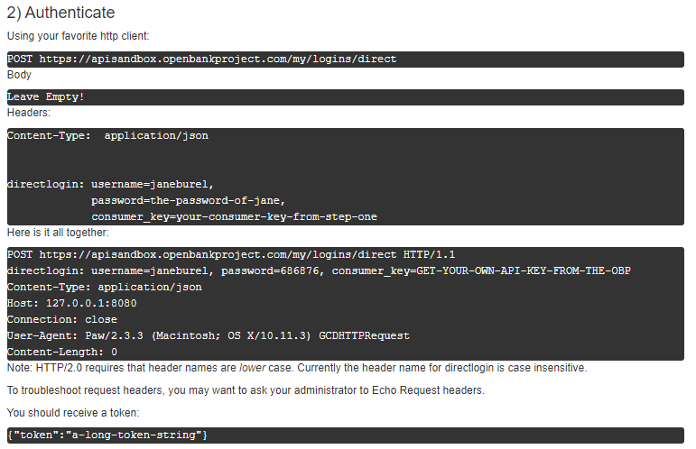
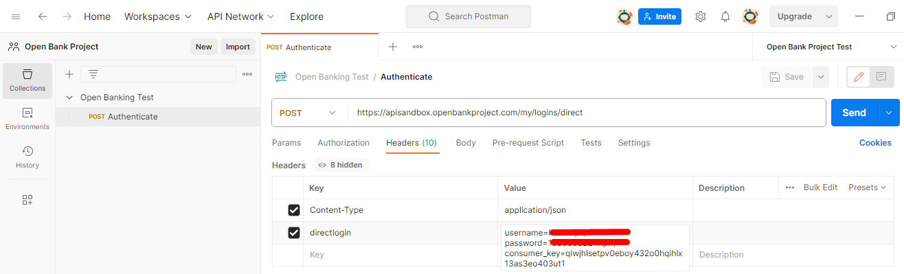
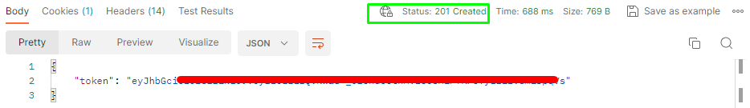
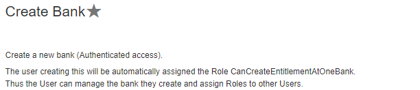

# Open Banking

## Configuración necesaria para interactuar con APIs de Open Bank Project

A fin de hacer uso de las APIs de open bank project se requiere hacer una configuracion inicial. A continuacion se define la configuracion necesaria:

### **1**. Ingresar en [openbankproject.com/](https://apisandbox.openbankproject.com/ "Open Bank Project")
   
### **2**. Crear una cuenta
   


### **3**. Obtener un API Key


Despues de obtener un API Key deberia llegar un correo electronico de confirmacion al correo que se uso para crear la cuenta en Open Bank Project


**IMPORTANTE**, se debe guardar el *Consumer Key* y el *Consumer Secret* en un lugar seguro ya que no va a ser posible volver a conseguirlos despues y por lo tanto habria que borrar la aplicacion y volver a crear otra.


### **4**.   Autenticarse

Hay por lo menos dos opciones para probar las APIs:


* En Postman
* Directamente en la pagina de Open Bank Project


Si uno desea hacerlo en Postman es necesario autenticarse por medio de la creacion de un token, el cual permite un logueo desde Postman. Pero si vamos a hacer pruebas directamente desde la pagina de Open Bank Project no hace falta hacer la creacion del token, pues en el momento que uno inicia sesion ya cuenta como un usuario logueado. 


#### **4.1**.  Autenticacion en Postman

A la fecha(2/11/2023) en la documentacion aparece esta guia:



Tenengamos en cuenta que tal como indica la documentacion unicamente se debe ingresar el endpoint POST *https://apisandbox.openbankproject.com/my/logins/direct*  y ingresar en el Header los dos parametros Content-Type y directlogin, por lo tanto no hace falta ingresar ningun dato adicional en Params, Authorization( el cual se puede dejar en type como inherith auth from parent), body, pre-request Script, Test, Settings. Si llevamos esto a Postman quedaria de esta forma:





Tengamos en cuenta que este Username y el password son los que se usaron para la creacion de la cuenta ( en el paso 2) de este tutorial) tal como indica la documentacion unicamente se debe ingresar el endpoint POST *https://apisandbox.openbankproject.com/my/logins/direct*  y ingresar los dos parametros Content-Type y directlogin.

#### **4.2**.  Creacion de token

Despues de ejecutar el request se deberia obtener lo siguiente:





Este token se usara posteriormente en el llamado de las demas APIs de Open Bank Project en Postman, como se menciono previamente, en caso  de que se hagan pruebas directamente en la pagina de Open Bank Project no sera necesario generar este token pues al iniciar sesion ya se cuenta como un usuario autenticado.


### **5**.   Obtener Rol CanCreateBank 

A fin de ensayar las diferentes APIs de Open Bank Project hay algo que ellos requieren para hacer uso de la gran mayoria de APIs, y consiste en un concepto llamado los roles, Estos roles son  un requisito fundamental para lograr llamados 200 a los diferentes Endpoints, Y ¿en que consiste este Rol de CanCreateBank? Este es un rol muy importante porque tal como indica su nombre por medio de este rol se hace posible usar una API que permite crear un banco, asi es, ¡es posible crear un banco propio con las APIs de Open Bank Project! En el proceso de prueba y error pude ver que lo mas practico a fin de probar las diferentes APIs era primeramente usar un endpoint para crear un banco y luego de crear el banco ya se hacia posible lograr mas facilmente porbar las demas APIs, por ejemplo, Open Bank Project ofrece una API que permite crear clientes, pero claro, para poder crear un cliente se requiere un rol llamado CanCreateCustomer, sin embargo, la forma mas facil de obtener ese rol es primeramente tener el rol de CanCreateBank ya que teniendo ese rol uno mismo puede concederse a si mismo el rol de CanCreateCustomer, y es que hay una larga lista de roles que se requieren para diferentes APIs, otro ejemplo, hay una api que permite crear tarjetas, pero para usar esa api se requiere un rol llamado CanCreateCardsForBank, y teniendo en cuenta que actualmente (2/11/2023) Open Bank Project tiene 587 APIs, podemos decir que hay muchisimos roles, asi que concluimos que pero una forma sencilla de empezar es usar la API llamada Create Bank



Con esta API podremos crear un banco y de ahi para adelante sera posible proceder con la creacion de clientes, cuentas, tarjetas y demas productos que estaran vinculados especificamente a ese banco. Sin embargo, un requisito importante para poder crear un banco es tener un rol llamado **CanCreateBank**. Entonces cabe preguntarnos, ¿Como se puede obtener ese rol?, una forma de lograrlo  es dirigirnos a la pagina principal de Open Bank Project y buscar la seccion de support:


Estando dentro del chat general se puede solicitar ayuda pidiendo a alguno de los asesores que nos permitan tener el rol de **CanCreateBank**


Luego de eso es cuestion de esperar la respuesta de alguno de los asesores ya que **sin el rol CanCreateBank no es posible proceder con las pruebas en el portal web ni postman** pero en el momento que recibimos ese rol recibiremos un correo electronico que se ve de esta forma:


Otra forma de verificar que efectivamente ya tenemos el rol de CanCreateBank es dirigirnos al portal web a la seccion de Create Bank:


### 5. Creando un banco usando la api Create Bank


Llegados a este punto y teniendo el rol de CanCreateBank ya estamos preparados para empezar a hacer uso de las APIs y teniendo ese rol podemos proceder a hacer la creacion de un banco usando la API llamada Create Bank. Hay por lo menos dos formas de hacer esto:

* En Postman
* En la pagina de Open Bank Project


#### 5.1 Veamos la forma de hacerlo en Postman:

En la pagina de Open Bank Project no hay opcion para descargar una coleccion de postman, asi que es necesario crearla uno mismo, pero es sencillo de hacer, veamos lo que dice la documentacion y como lo podemos llevarlo a Postman, si nos dirigimos a la seccion de Create Bank veremos lo siguiente:


Como podemos ver en esa barra de texto vemos ciertos datos, pues, esos datos corresponden al body que se envia en el request asi que lo que debemos hacer es copiar ese body y ponerlo en el request de Postman, sin embargo, aqui les comparto el Body para que puedan copiarlo


``` json
{  
	"id":"testkp",  
	"bank_code":"CGHZ",  
	"full_name":"full name string",  
	"logo":"logo url",  
	"website":"www.openbankproject.com",  
	"bank_routings":[{    
		"scheme":"scheme value",    
		"address":""  
        }]
}
```


Es de notar que uno puede modificar el body y cambiar el id, el bank_code, full_name y demas parametros. Asi quedaria:


Ahora procedemos a configurar el Header, la documentacion dice lo siguiente respecto al Header:


``` json
{  
	"Accept-Charset": "UTF-8"
	"Accept": "application/json"
	"content-type": "application/json;charset=utf-8"
}
```


Asi quedaria en Postman:


Sin embargo, es de notar que tal como se menciono anteriormente, en vista de que aqui estamos en postman es necesario autenticarse para evitar un error de autenticacion, y esto se logra ingresando ese parametro *directlogin* y como observamos es importante poner el token generado previamente en el paso 4.2 y de esta forma ya estaremos autenticados desde postman.

En caso de que el banco ya exista obtendremos un error 400:


Asi que seria necesario cambiar el id del banco en el body.


#### 5.2 Respuesta en Postman

Perfecto! ya tenemos la creacion de un banco, a continuacion se pueden ver los parametros en la respuesta JSON


